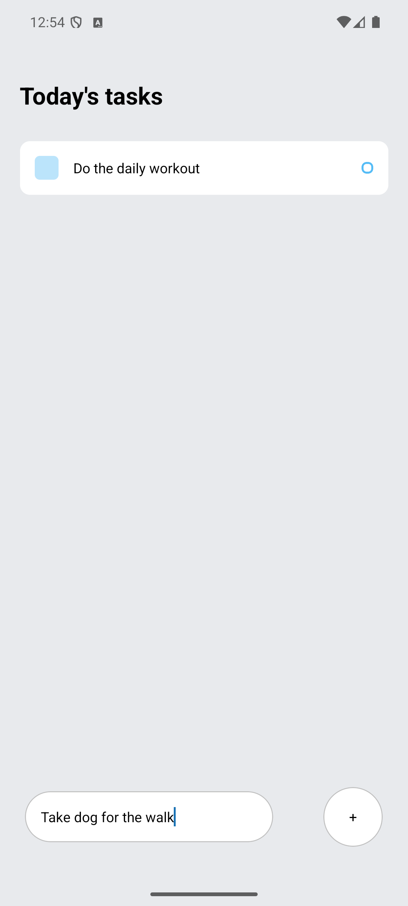
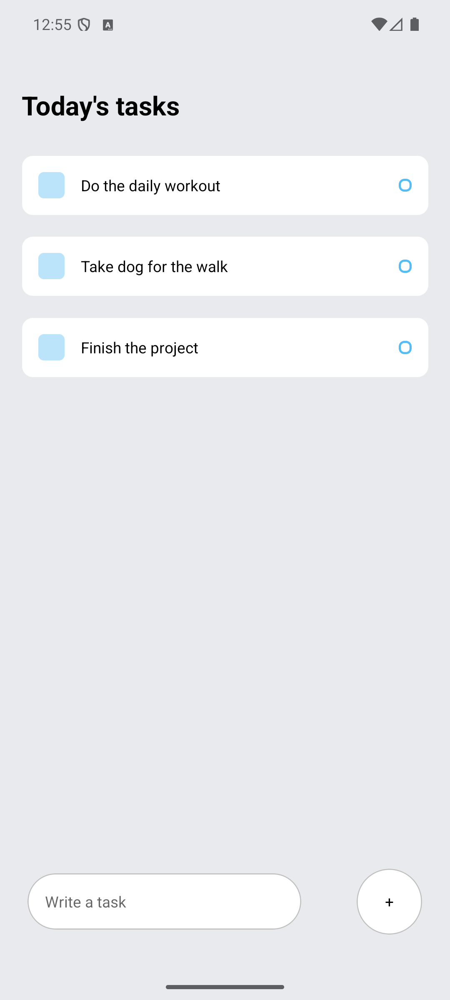
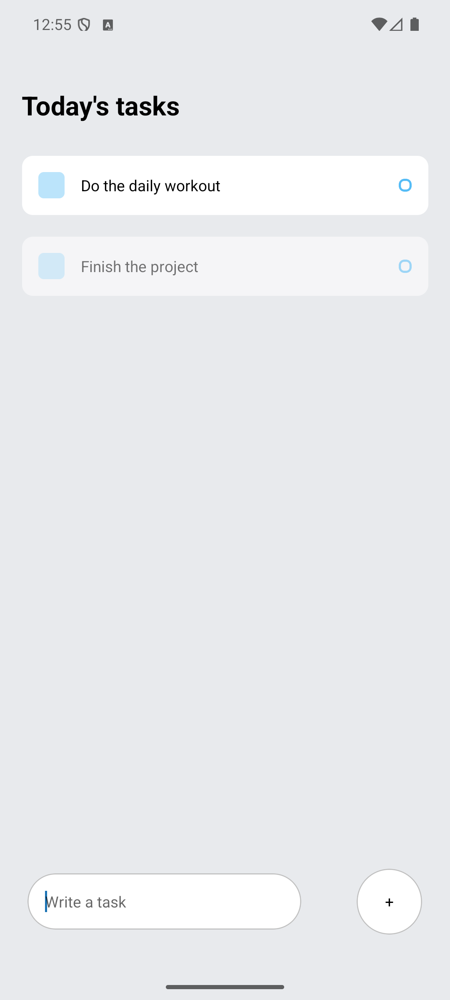

# React Native To-Do App

A clean and simple mobile To-Do List application built using React Native and Expo.

## Features
- Add tasks
- Delete tasks
- Real-time UI updates
- Mobile-friendly design

## Tech Stack
- React Native
- Expo
- JavaScript

## Screenshots

<p float="left">
  
  
  
</p>

## How to Run Locally
```bash
npm install
npx expo start
```

## Future Improvements
- Save tasks using AsyncStorage
- Mark tasks as completed
- Add animations or improved UI

## Author
**Anand**
